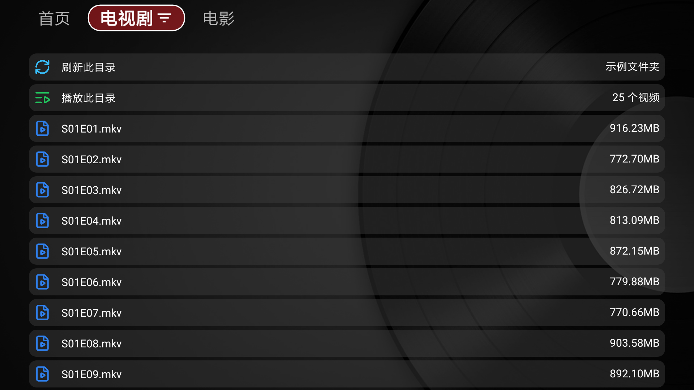

# openlist-tvbox



`openlist-tvbox` 是一个面向 TVBox / CatVodSpider 的 OpenList / AList 中转网关。

它把服务端配置好的 OpenList / AList 网盘内容转换成 TVBox 可识别的分类、目录、搜索、播放数据。TVBox 客户端只访问本项目提供的网关接口，不直接接触 OpenList API key、账号密码或登录 token。

English documentation: [README.en.md](README.en.md)

## 功能特性

- 支持 OpenList / AList v3 访问。
- 支持匿名、API key、账号密码三种后端认证方式。
- 支持多个 OpenList / AList 后端。
- 支持多个 TVBox 订阅入口，每个订阅可以挂载不同后端、不同路径。
- 支持目录浏览、排序筛选、详情页播放列表、搜索和播放地址解析。
- 支持同目录字幕识别并随播放结果返回。
- 支持给订阅配置数字访问码，避免订阅地址被随意使用。
- 内置 TVBox Spider JavaScript，订阅配置可直接引用网关内置脚本。
- 网关只开放明确的 TVBox 专用接口，不提供任意 OpenList API 转发或任意 URL 代理。

## 已测试 App 壳

以下 App 壳已完成测试：

- [takagen99/Box](https://github.com/takagen99/Box)
- [FongMi/TV](https://github.com/FongMi/TV)

## 快速开始

1. 准备配置文件。

   从 [config.example.yaml](config.example.yaml) 复制一份为 `config.yaml`，按需修改后端和订阅入口。完整字段说明见下方“配置说明”。

2. 启动网关。

   ```bash
   ./openlist-tvbox -config config.yaml -listen :18989
   ```

3. 在 TVBox 中填入订阅地址。

   ```text
   http://你的网关地址:18989/sub
   ```

   反向代理、NAT、CDN 场景建议在配置中设置 `public_base_url`，确保 TVBox 拿到的是外部可访问地址。

## 部署方式

### 使用发布包

从项目 Release 下载与你的系统匹配的压缩包，解压后得到 `openlist-tvbox` 或 `openlist-tvbox.exe`，再按上面的快速开始准备配置并启动。

### 容器部署

示例运行参数：

```bash
docker run -d \
  --name openlist-tvbox \
  -p 18989:18989 \
  -v /path/to/config.yaml:/config/config.yaml:ro \
  ghcr.io/outlook84/openlist-tvbox:latest
```

## 接入 TVBox

快速开始中的 `/sub` 是默认订阅入口。如果你在配置中定义了多个订阅入口，每个 `subs[].path` 都是一个独立订阅 URL，例如：

```text
http://你的网关地址:18989/sub
http://你的网关地址:18989/sub/movies
http://你的网关地址:18989/sub/shows
```

TVBox 会从订阅中加载内置 Spider 脚本，后续的分类、目录、搜索和播放请求都会回到网关处理。

## 访问码

订阅访问码使用 bcrypt hash 保存。

生成访问码 hash：

```bash
./openlist-tvbox -hash-password 123456
```

容器部署时可以在已启动容器中执行：

```bash
docker exec openlist-tvbox openlist-tvbox -hash-password 123456
```

然后把输出结果填写到对应订阅的 `access_code_hash`。访问码必须是 4 到 12 位数字，适配 TVBox 侧数字键盘输入。

## 配置说明

建议从示例配置复制后修改，完整字段说明也在示例配置中：

- [config.example.yaml](config.example.yaml)
- [config.example.en.yaml](config.example.en.yaml)

常用配置入口：

- `public_base_url`：TVBox 看到的网关外部地址。
- `backends`：真实 OpenList / AList 服务配置。
- `subs`：对 TVBox 暴露的订阅入口。
- `subs[].mounts`：把后端路径挂载成 TVBox 分类。
- `access_code_hash`：订阅访问码 hash。

## 安全说明

- OpenList API key、账号密码和登录 token 只保存在网关服务端。

## 常用命令
打印起始配置：

```bash
./openlist-tvbox -print-config-example
```

指定配置文件和监听地址：

```bash
./openlist-tvbox -config config.yaml -listen :18989
```

健康检查：

```text
http://your-ip:18989/healthz
```
